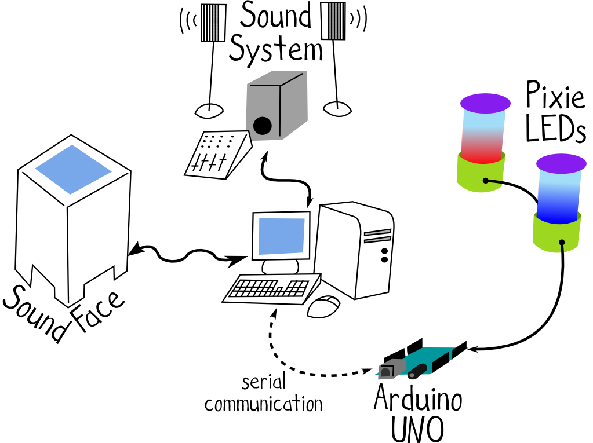
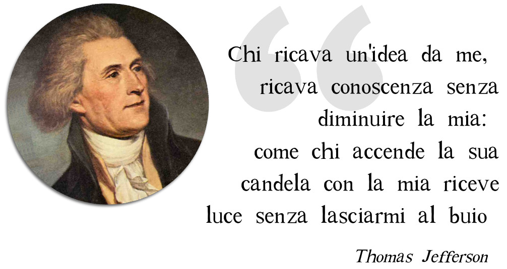
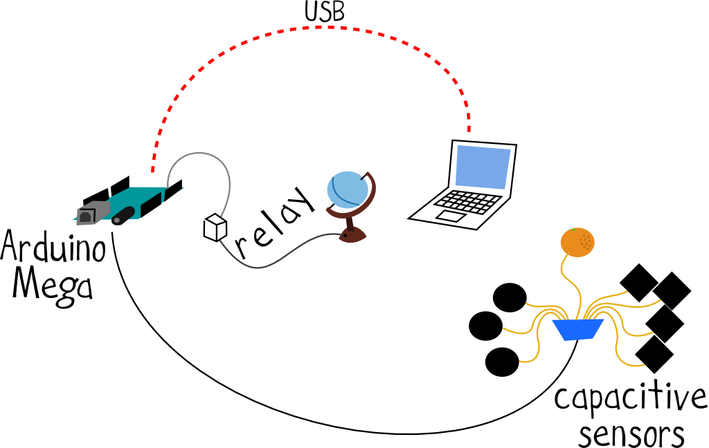

[**limulo.net**](http://www.limulo.net) è il nome con cui **Valentina Lorè** e **Nicola Ariutti** identificano i propri interessi e tutto un insieme di progetti da loro realizzati. **limulo.net** è anche il nome di un sito internet da loro curato all'interno del quale raccolgono articoli, files, documenti, registrazioni sonore, video e codice di tutti i loro lavori.

Valentina e Nicola nascono come _sound engineer_ e nutrono parallelamente all'interesse per musica e il sound design una grande passione per la programmazione e la computer science più in generale.

Tra tutti i lavori finora realizzati da _limulo.net_, di sicuro quello che meglio riassume le loro diverse sfere di interesse è **SoundFace**

## progetto SoundFace

Il progetto **SoundFace** si basa sul lavoro svolto dall'università _Pompeu Fabra_ di Barcellona con [reacTable](http://reactable.com/). Si tratta sostanzialmente di una superficie musicale interattiva in cui l'utente può costruire e modificare i vari parametri e suoni in tempo reale semplicemente posizionando su di essa alcuni oggetti speciali chiamati _fiducials_. 

Il programma che fa funzionare **SoundFace** è stato scritto facendo uso delle librerie [openFrameworks](http://openframeworks.cc/) per quanto concerne la parte grafica, [PureData](http://puredata.info/) per la generazione di suoni e musica in tempo reale, [reacTIVision](http://reactivision.sourceforge.net/) per la parte relativa all'elaborazione dell'immagine proveniente dalla telecamera ad infrarossi.

Recentemente è stata aggiunta una nuova componente all'esperienza interattiva: si tratta di due LEDs RGB ad alta luminosità che vengono pilotati a tempo di musica da una scheda [Arduino](https://www.arduino.cc/)!

<iframe width="100%" height="315" src="https://www.youtube.com/embed/tiX9etAAEcI" frameborder="0" allowfullscreen></iframe>

Per maggiori informazioni sul suo funzionamento e per approfondire le tecnologie implementate si rimanda al sito [limulo.net](http://www.limulo.net); ecco [qui](http://www.limulo.net/resources/electropark-2013/Electropark-2013-slides.pdf) invece alcune slide per una rapida consultazione.

<iframe width="100%" height="315" src="https://www.youtube.com/embed/0xcAOFFxWuc" frameborder="0" allowfullscreen></iframe>

### Strumenti liberi

Come tutti i progetti di **limulo.net**, anche _SoundFace_ fa uso esclusivamente di strumenti **liberi** (_free software_ e _open source_). 

Che cosa significa? Significa che tutti i software utilizzati sposano la _filosofia_ del software libero nata negli anni '80 ad opera di **Richard Stallman** e poi diffusasi sempre più, secondo cui la **condivisione** (in questo caso delle istruzioni che costituiscono i programmi per computer), non può che migliorare i programmi stessi, la nostra esperienza d'uso del computer e la nostra **libertà** come individui.

> Se un programma mi piace lo devo condividere con altre persone cui piace.
> (da una mail di Richiard Stallman datata 27 Settembre 1983.)

La filosofia del _software libero_ ha in seguito contaminato anche tutte le altre sfere del sapere e dell'opera dell'uomo, un esempio su tutti sono le licenze **Creative Commons** pensate da **Lawrence Lessig**.

Si potrebbe parlare a lungo di questo argomento, per questo ecco qui alcuni spunti di approfondimento:

* un paio di immagini al volo [qui](assets/bignami.pdf);
* da [qui](https://github.com/ariutti/book-test/raw/master/export/book-test.epub) è possibile scaricare un piccolo saggio all'interno del quale si trovano alcuni riferimenti utili;
* Richard Stallman, "**Software Libero, Pensiero Libero**", Nuovi Equilibri, 2003. Titolo originale dell'opera: "Free Software, Free Society: The Selected Essays of Richiard M. Stallman";
* Lawrence Lessig, "**Cultura Libera**", Apogeo 2005. Titolo originale dell'opera: "Free Culture";

## Linux Day - front desk

Abbiamo parlato di software libero e di sicuro quello più conosciuto è **GNU/Linux**, un sistema operativo che nulla ha da invidiare ai più diffusi Windows e MacOs. 

Il simbolo di GNU/Linux è un pinguino per questo ecco un' altra installazione realizzata per l'evento [**Linux Day**](http://www.linuxdaymilano.org), riferimento per utilizzatori e simpatizzanti del software libero in Italia.

Si tratta di una stazione interattiva che fa uso di una scheda di prototipazione elettronica basata su **Arduino**, di un sensore capacitivo applicato sotto al coperchio di una piccola scatola e di due **servomotori**.

Avvicinandosi alla scatola si genera uno stimolo elettrico che viene poi elaborato dal software caricato sulla scheda **Arduino**. La scheda quindi si preoccupa a sua volta di inviare un segnale elettrico ai servomotori, responsabili del movimento dell'ala del pinguino e delle campanelle.

## Linux Day - stazione interattiva #2

All'evento [**Linux Day**](http://www.linuxdaymilano.org) era presente un'altra stazione interattiva che sfruttava, in modo diverso, la stessa tipologia di sensore capacitivo: questa volta rilevando uno stimolo tattile.

Alcuni elettrodi dipinti con vernice conduttiva su di un normale foglio di carta permettono ad **Arduino** e ad alcuni altri circuiti ad esso connessi di inviare messaggi ad un computer per generare suoni e grafiche in tempo reale.

Per un po' di colore in più e per differenziare l'eseprienza interattiva, uno degli elettrodi è un **mandarino**. 

Toccando il mandarino si triggera la generazione di un nuovo suono e allo stesso tempo si comanda un _relay_ per l'accensione di una lampada-mappamondo!

Il momento più stimolante è di sicuro quello dell'evento, quando si ha modo di mostrare il proprio lavoro e raccogliere le reazioni del pubblico. 

Quando si mostra qualcosa di nuovo di cui non si ha alcuna esperienza, l'utente agisce usando l'istinto: questa stazione interattiva è stata usata da alcuni bambini i quali istintivamente posizionavano il mandarino al di sopra degli elettrodi di forma circolare, come intravedendo tra questi una connessione nascosta. 

Seppure non nelle intenzioni iniziali, l'installazione ha rivelato in quel momento una nuova applicazione inaspettata.
Nel realizzare un nuovo progetto bisogna quindi sempre tenere a mente che la reazione delle persone potrebbe talvolta non rispecchiare la propria idea d'uso dell'installazione stessa. 

E' importante quindi che l'esperienza interattiva sia intutiva e risulti naturale; e comunque un eventuale _incidente di percorso_ non è necessariamente da considerarsi un male:

> Onora l'errore come una intenzione nascosta [Brian Eno]

Tutti i suoni prodotti dalla stazione interattiva sono generati in tempo reale da un programma scritto in linguaggio [SuperCollider](https://supercollider.github.io/), molto usato anche in ambito [_live coding_](https://en.wikipedia.org/wiki/Live_coding) (questo [link](http://toplap.org/) per approfondire).

La parte grafica è appannaggio di [Processing](https://processing.org/), un linguaggio di programmazione pensato proprio per questo ma non solo.

### Processing

Vale la pena di spendere giusto un paio di parole riguardo questo strumento, tanto versatile quanto semplice da imparare.

Citando le parole tratte dal sito ufficiale 

> **Processing** è uno sketchbook flessibile e uno strumento per imparare a programmare nel contesto dell'arte visiva.

Una sorta di blocco note software facile e di veloce impiego che anche **limulo.net** utilizza spessissimo come primo stadio per stendere e testare rapidamente le nuove idee prima dei successivi sviluppi.

Punto di forza di _Processing_ è la sua semplicità e la grande community di supporto. _Processing_ è facile da imparare soprattutto perchè si può contare su di un valentissimo e simpaticissimo insegnante: **Daniel Shiffman**. Per farsi un'idea di quali siano le potenzialità di _Processing_ o per impare a scrivere le primissime righe di codice ecco qui un [link](http://hello.processing.org/) fondamentale.

<iframe width="100%" height="315" src="https://www.youtube.com/embed/qUVWM2Q4vAU" frameborder="0" allowfullscreen></iframe>

Caldamente consigliato il primo libro di Shiffman, **Learning Processing**, pubblicato sull'argomento e consultabile liberamente anche on-line dal [sito](http://learningprocessing.com/) ufficiale. Altra importante risorsa è la serie di [video YouTube](https://www.youtube.com/watch?v=2VLaIr5Ckbs) curata dall'autore.

## Audio

Valentina e Nicola nascono come tecnici del suono e così al suono è dedicata una grande cura in ognuno dei progetto di _limulo.net_. A volte questo significa inventarsi nuovi suoni o manipolarne di esistenti in tempo reale come si è visto.

In altri casi invece è fondamentale confezionare atmosfere sonore che provengono dall'esperienza quotidiana, che siano in grado di creare il giusto coinvolgimento ed immersione dell'utente all'interno dell'installazione.

## Petunia

E' il caso di **Petunia** una videoinstallazione scritta in _Processing_ che simula uno stagno e anima a schermo una rana ed una zanzara con le queli il giocatore può interagire in vari modi.

L'allestimento prevede un sensore ad ultrasuoni a rilevare l'avvicinamento o l'allontanamento del giocatore mentre un sistema di computer vision capta un input luminoso che il giocatore utilizza per muovere la zanzara a schermo.

<iframe width="100%" height="315" src="https://www.youtube.com/embed/eeRPe6KmdKI" frameborder="0" allowfullscreen></iframe>

Le atmosfere sonore sono realizzate combinando diversi suoni pre-registrati appositamente e che vengono miscelati in tempo reale a seconda degli stimoli inviati dal giocatore.

  

  <audio controls="controls" style="width:100%;">
    Your browser does not support the <code>audio</code> element.
    <source src="assets/sounds/sottofondo_canneto_pink.ogg" type="audio/ogg">
  </audio>
  

  

  <audio controls="controls" style="width:100%;">
    Your browser does not support the <code>audio</code> element.
    <source src="assets/sounds/sottofondo_rane.ogg" type="audio/ogg">
  </audio>
  

## Collaborazioni

Quando ci si trova a collaborare in un team è importante cercare di avvicinarsi alle esigenze degli altri. Pur dedicandosi ad un solo aspetto del progetto, avere una visione d'insieme aiuta a lavorare meglio e avere sempre sotto controllo evetuali problemi e difficoltà che possono insorgere durante il percorso.

## Chaotic Robots Music

Qui _limulo.net_ sperimenta con la musica collaborando al progetto [Chaotic Robots](http://dev.hacklabterni.org/projects/cr21) a cura dell'[HackLab di terni](http://hacklabterni.org/).

 | 

Alcuni robot costruiti dai ragazzi dell'HackLab, il cui scafo è stato progettato e reallizzato in stampa 3D dallo studio [GreenTales](http://www.greentales.it/), montano un sistema elettronico particolare che permette loro di muoversi liberamente nello spazio ed evitarsi l'un l'latro seguendo traiettorie pseudocasuali.

Queste traiettorie vengono poi registrate da una webcam, rielaborate graficamente e proiettate. 

<iframe width="100%" height="315" src="https://www.youtube.com/embed/SDqNaqEHwzE" frameborder="0" allowfullscreen></iframe>

Le stesse informazioni sulle traiettorie sono elaborate in modo diverso per aggiungere all'allestimento una colonna sonora musicale che risponda ai movimenti dei robot. 

<iframe width="100%" height="315" src="https://www.youtube.com/embed/AFzdYw6yQ4o" frameborder="0" allowfullscreen></iframe>

Un patch scritta in linguaggio _PureData_ analizza i dati dei robot e li usa per comporre la partitura musicale seguendo delle regole matematiche e di probabilità.

## OTTO

_PureData_ è un programma veramente versatile per la manipolazione del segnale sonoro ed è stato più volte utilizzato in situazioni di sonorizzazzione di video, spot pubblicitari e cartoni animati.

Di seguito **OTTO**, un video realizzato principalmente in tecnica _stop-motion_ da **Dario Imbrogno**, **Salvatore Murgia** e **Giancarlo Morieri**, per il quale **limulo.net** ha curato il _sound design_. Tutto quello che sentirete è stato processato usando _PureData_. 

<iframe src="https://player.vimeo.com/video/118407522" width="100%" height="360" frameborder="0" webkitallowfullscreen mozallowfullscreen allowfullscreen></iframe>

## Lexus

In altre sitauzioni invece **limulo.net** si concentra esclusivamente sulla prototipazione elettronica e sulla progettazione software. 

In collaborazione con il musicista, compositore e produttore **Fabio Senna**, viene reallizzata una installazione interattiva per Toyota in occassione della presentazione del modello di automobile Lexus RC Hybrid.

L'installazione prevede diversi punti di interazione di diverse tipologie: 

* sensori di prossimità ad ultrasuoni disseminati lungo il perimetro dell'automobile rilevano l'avvicinamento e l'allontanamento degli avventori;

* piccoli microfoni piezoelettrici sono applicati alle lamiere di cofano, tettuccio e baule per registrare movimenti percussivi;

* il baule monta un accelerometro per registrare l'apertura e la chiusura dello stesso;
* anche le portire offrono punti di interazione aggiuntivi: la loro apertura/chiusura viene registrata usando sensori magnetici;

* infine all'interno dell'abitacolo due sensori capacitivi reagiscono al tocco del volante e della leva del cambio.

Tutti questi dati vengono misurati da una scheda _Arduino_ e poi inviati ad un software di controllo scritto in _PureData_. 

I dati processati sono poi inoltrati ad un altro software sottoforma di messaggi _MIDI_ per generare una colonna sonora responsiva diffusa sia nell'abitacolo dell'auto tramite gli altoparlanti interni, sia nello spazio esterno.

## Altri Riferimenti

Il sito internet [limulo.net](http://www.limulo.net) è il principale punto di riferimento per tutti i lavori qui mostrati e non solo. Dal sito è inoltre possibile risalire a ciascuno dei progetti di _limulo.net_ per scaricare i programmi e i codici sorgente liberi. Sul sito di parla inoltre di **videogames**, **computer grafica**, **Audio procedurale** e molto altro.

**limulo.net** è felice di ricevere commenti, idee, domande e suggerimenti in merito agli argomenti che abbiamo trattato durante l'incontro o altro. Il riferimento mail è il seguente **info[at]limulo.net**, saremo felici di rispondervi.

 

